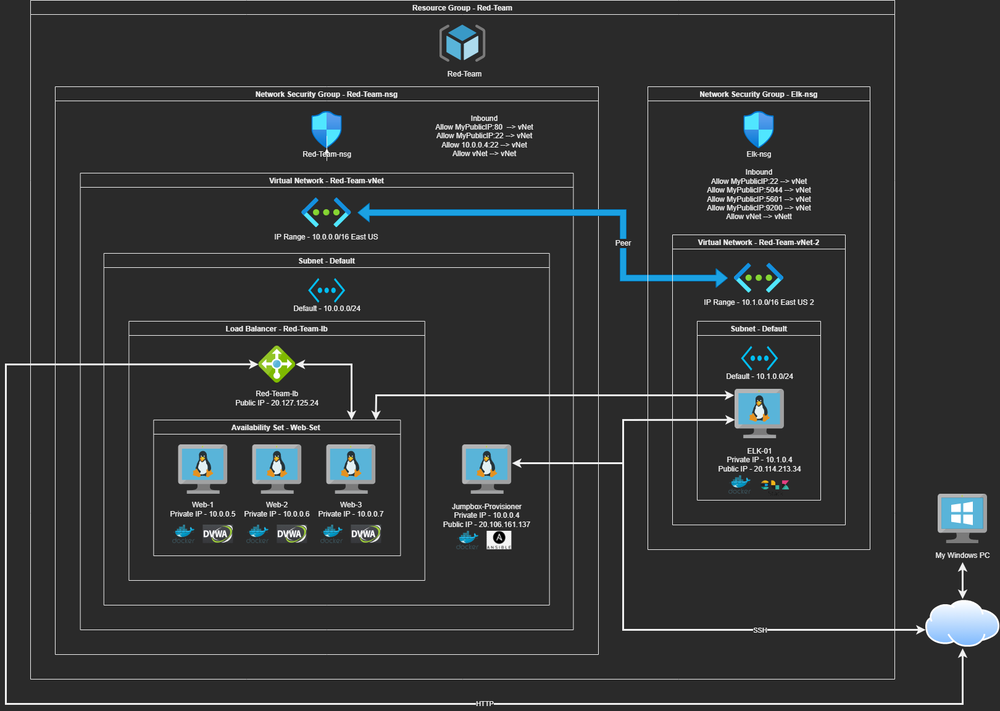

## Automated ELK Stack Deployment

The files in this repository were used to configure the network depicted below.

These files have been tested and used to generate a live ELK deployment on Azure. They can be used to either recreate the entire deployment pictured above. Alternatively, select portions of the yaml file may be used to install only certain pieces of it, such as Filebeat.

  - [My playbook](/Ansible/my-playbook.yml)
    - Sets up a set of high available web servers and prepares DVWA.
  - [Filebeat playbook](/Ansible/filebeat-playbook.yml)
    - Sets up Filebeat on the web servers to push logs to the ELK server.
  - [Metricbeat playbook](/Ansible/metricbeat-playbook.yml)
    - Sets up Metricbeat on the web servers to push metrics to the ELK server.
  - [ELK playbook](/Ansible/elk-playbook.yml)
    - Sets up ELK on a server that has a public IP.

### This document contains the following details:
- Description of the Topologu
- Access Policies
- ELK Configuration
  - Beats in Use
  - Machines Being Monitored
- How to Use the Ansible Build

### Description of the Topology

The main purpose of this network is to expose a load-balanced and monitored instance of DVWA, the D*mn Vulnerable Web Application.

Load balancing ensures that the application will be highly available, in addition to restricting access to the network.
- The load balancer ensures that each host is not overloaded with requests.
- The load balancer allow you to scale the number of servers hosting the site on the backend without affecting the site's availability. 
- The load balancer can also handle SSL requests. Our DVWA website is only doing HTTP in this scenario.

Integrating an ELK server allows users to easily monitor the vulnerable VMs for changes to the files and system monitoring.
- Filebeat handles syslog monitoring.
  - Any changes to the system that are recorded by syslogs will show up in Filebeat.
- Metricbeat handles the monitoring of system resources.
  - System usage like CPU, memory, disk, and network statics show up in Metricbeat.

The configuration details of each machine may be found below.

| Name                | Function | IP Address | Operating System |
|---------------------|----------|------------|------------------|
| ELK-01              | ELK stack | 10.1.0.4  | Ubuntu LTS 20.04 |
| Jumpbox-Provisioner | Gateway  | 10.0.0.4   | Ubuntu LTS 20.04 |
| Web-1               | Server   | 10.0.0.5   | Ubuntu LTS 20.04 |
| Web-2               | Server   | 10.0.0.6   | Ubuntu LTS 20.04 |
| Web-3               | Server   | 10.0.0.7   | Ubuntu LTS 20.04 |

### Access Policies

The machines on the internal network are not exposed to the public Internet. 

Only the Jumpbox-provisioner and ELK machines can accept connections from the Internet. Access to these machines are only allowed from the following IP addresses:
- My public IP is the only IP whitelisted to allow access via port 22 (SSH) and the ELK server is allowing ports 5044, 5601, and 9200 so that I can view Kibana's web page.
- The internal web servers are behind a load balancer that are only accepting port 80 (HTTP) access from my public IP.

Machines within the network can only be accessed by Jumpbox-provisioner via SSH.
- Which machine did you allow to access your ELK VM?
  - My home PC has it's public IP whitelisted so that I can view the Kibana web page.
- What was its IP address?
  - http://20.114.213.34:5601/app/kibana

A summary of the access policies in place can be found in the table below.

| Name     | Publicly Accessible | Allowed IP Addresses |
|----------|---------------------|----------------------|
| ELK-01 | Yes, via 20.114.213.34 | vNet, 10.0.0.4, My Public IP |
| Jumpbox-Provisioner | Yes,  via 20.106.161.137 | vNet, My Public IP |
| Web-1 | No | vNet, 10.0.0.4 |
| Web-2 | No | vNet, 10.0.0.4 |
| Web-3 | No | vNet, 10.0.0.4 |

### Elk Configuration

Ansible was used to automate configuration of the ELK machine. No configuration was performed manually, which is advantageous because...
- It is scalable. No matter how many servers need to be deployed, you can configure each to be identical.
- Once a playbook is configured, you remove the human element from making a mistake while trying to configure large numbers of server at one.
  - One distraction and you forget to modify a varible in the configuration file. Now that server isn't doing what was intended or pointing at the correct IP.
- It is a massive time saver. Traditional hands on aaproach would take quite a while to configure even a few servers.

The playbook implements the following tasks:
- Updates the server's repo cache so it knows about docker.io and pip.
- It sets system variables to a defined value so that it can allocate for virtual memory to ELK.
- Installs docker.io using apt.
- Installs python3-pip using apt.
- Installs docker using pip.
- Enables docker to auto start on boot.
- Reaches out to docker and gets ELK version 761
  - Starts the service.
  - Maps port bindings to 5044, 5601, and 9200.

The following screenshot displays the result of running `docker ps` after successfully configuring the ELK instance.

### Target Machines & Beats
This ELK server is configured to monitor the following machines:
- _TODO: List the IP addresses of the machines you are monitoring_

We have installed the following Beats on these machines:
- _TODO: Specify which Beats you successfully installed_

These Beats allow us to collect the following information from each machine:
- _TODO: In 1-2 sentences, explain what kind of data each beat collects, and provide 1 example of what you expect to see. E.g., `Winlogbeat` collects Windows logs, which we use to track user logon events, etc._

### Using the Playbook
In order to use the playbook, you will need to have an Ansible control node already configured. Assuming you have such a control node provisioned: 

SSH into the control node and follow the steps below:
- Copy the _____ file to _____.
- Update the _____ file to include...
- Run the playbook, and navigate to ____ to check that the installation worked as expected.

_TODO: Answer the following questions to fill in the blanks:_
- _Which file is the playbook? Where do you copy it?_
- _Which file do you update to make Ansible run the playbook on a specific machine? How do I specify which machine to install the ELK server on versus which to install Filebeat on?_
- _Which URL do you navigate to in order to check that the ELK server is running?

_As a **Bonus**, provide the specific commands the user will need to run to download the playbook, update the files, etc._
